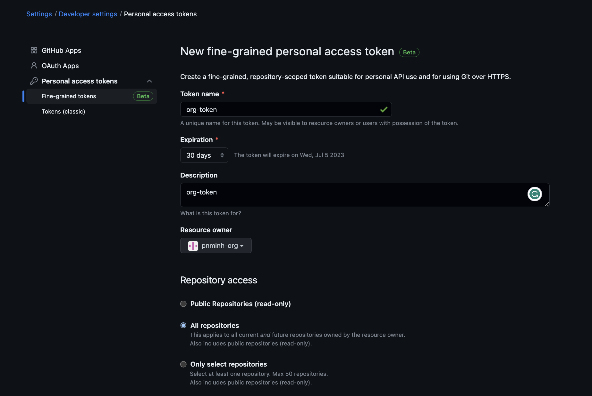

## Install Jenkins server
### Set up K8s cluster
```
$ minikube start
$ minikube status

minikube
type: Control Plane
host: Running
kubelet: Running
apiserver: Running
kubeconfig: Configured
```
Install Jenkins using helm chart
```
$ helm repo add jenkins https://charts.jenkins.io
$ helm repo update
$ kubectl create namespace jenkins
$ helm install jenkins --namespace jenkins jenkins/jenkins --wait
$ kubectl --namespace jenkins port-forward svc/jenkins 8080:8080
```
  
  
  
  
  
  
  
Install Github plugins for Jenkins
  

Get Org API endpoint
- Go to org > Settings > Developer Settings > OAuth Apps
    

- Go to Org > Settings >   
- Go to User account > Developer settings > Personal access tokens > Fine grained tokens
  
- Can choose classic github token
- Add github enterprise server
    
- Configure org repos(creds are username/password)
  
- Allow Jenkinsfile from other repo to be used(need to restart Jenkins to have it take effect). Also requires [GitHub Branch Source plugin ](https://docs.cloudbees.com/docs/cloudbees-ci/latest/cloud-admin-guide/github-branch-source-plugin)
  
- Full configuration:
<video src='images/fullscreen.mov' width=180/>