## Organization pipeline using centralized Jenkinsfile
When developing an application and utilizing Jenkins pipeline for CI/CD, it's common to have a Jenkinsfile stored in the same repository as the application. This allows easy configuration of the Jenkinsfile to meet the specific CI/CD requirements of the application.

However, in large organizations, allowing a custom Jenkinsfile in each application repository can have its drawbacks. These include:

* **Code vs. Jenkinsfile**: The application team must balance their focus on writing code for users with maintaining the quality and upkeep of the Jenkinsfile.

* **Cumbersome support**: Supporting organization-wide CI/CD process becomes challenging with teams using unique approaches.

* **Policy compliance**: Enforcing company policies for the CI/CD process, such as security scanning, becomes difficult as application teams are free to implement their own customized workflows.

To tackle these challenges, Jenkins shared libraries can be used, but this approach may still allow application teams to utilize their own Jenkinsfile and introduce undesired customizations.

The [Remote Jenkinsfile Provider](https://plugins.jenkins.io/remote-file/) plugin may offer a solution to those issues. It enables a centralized Jenkinsfile with the `Organization Folder` and `MultiBranch` pipeline options in Jenkins. By adopting this approach, organizations can establish and enforce uniform CI/CD processes and policies across development teams, ensuring consistency and standardization.

This article provides a comprehensive guide on establishing an organization-wide CI/CD pipeline using a centralized Jenkinsfile. We'll cover the step-by-step process, starting with UI setup and transitioning seamlessly to everything-as-code configurations.

## Set up Jenkins server
### Installation options
We will use a local Jenkins server to showcase the process outlined in this article. Among many [installation options](https://www.jenkins.io/doc/book/installing/), containerization emerges as an outstanding choice owing to its remarkable advantages:

* **Isolation and Portability**: Running Jenkins in a container ensures consistent operation across different environments, allowing easy migration and replication on any host system supporting the containerization platform.

* **Easy Deployment and Scalability**: Containerization simplifies deployment with a single container image and enables effortless scaling to handle increased workloads.

* **Version Management and Rollbacks**: Jenkins container images can be versioned and tagged, facilitating easy tracking and rollback to previous versions.

* **Dependency Management**: Containerization provides a self-contained environment, eliminating conflicts with other applications and allowing for efficient management of Jenkins dependencies.

* **Resource Efficiency**: Containers can be configured with specific resource limits, optimizing resource utilization and enabling multiple Jenkins instances on the same host.

* **Easy Updates and Maintenance**: Updating Jenkins becomes straightforward by updating the container image, reducing the risk of disrupting the host environment or other applications.

[Red Hat OpenShift Local](https://developers.redhat.com/products/openshift-local), a lightweight single-node Openshift cluster,  is an excellent choice for deploying our Jenkins containers. OpenShift provides Kubernetes core features with enhanced security, integrated developer experience, and enterprise-focused functionalities. Follow this [link](https://access.redhat.com/documentation/en-us/red_hat_openshift_local/2.5/html/getting_started_guide/installation_gsg) for step-by-step installation instructions tailored to your operating system.

### Installing Jenkins server using Helm chart
To simplify the installation process further, we will leverage the [official helm chart](https://artifacthub.io/packages/helm/jenkinsci/jenkins) developed by Jenkins. This helm chart enables rapid installation with convenient customization options for easy configuration. We use the default configs for the first iteration.
Start with creating a project for Jenkins
```
$ oc new-project jenkins
```
By default OCP run pods with non-privileged access to mitigate risks, restrict capabilities, and prevent harmful actions within the cluster, so we need a helm values file for Jenkins with following overridden values to account for that setup:
```yaml
controller:
  installLatestSpecifiedPlugins: true
  podSecurityContextOverride: #required for pod running on OCP
    runAsNonRoot: true
    runAsUser: 1000650000
    runAsGroup: 1000650000
  containerSecurityContext: #required jenkins init container
    runAsUser: 1000650000
    runAsGroup: 1000650000
  initContainerEnv: #https://github.com/jenkinsci/helm-charts/issues/506
    - name: CACHE_DIR
      value: "/tmp/cache"
```
### Installing required plugins
We can access the Jenkins UI at http://localhost:8080 via port-forwarding.
```
$ oc --namespace jenkins port-forward svc/jenkins 8080:8080
```
Log in with the admin user and the password generated during Jenkins installation.

Navigate to `Manage Jenkins > Plugins > Available plugins` and install the following plugins:

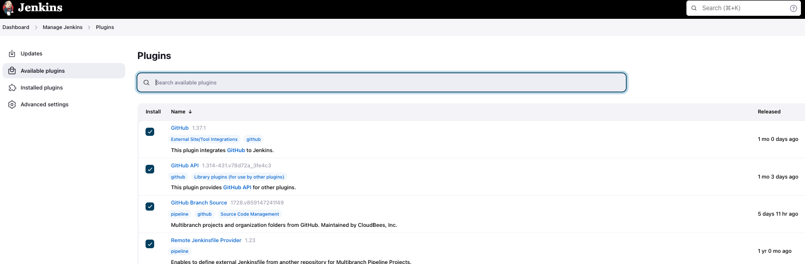  


- [GitHub](https://plugins.jenkins.io/github/): integrates Jenkins with Github projects as we will use Github as our example   
- [GitHub Branch Source](https://plugins.jenkins.io/github-branch-source/): integrate `Organization Folder` and `Multibranch Pipeline`  items with GitHub
- [Remote Jenkinsfile Provider](https://plugins.jenkins.io/remote-file/): allow using a centralized Jenkinsfile from a remote repository
- [GitHub API](https://plugins.jenkins.io/github-api/): dependency for other GitHub related plugins.

Make sure Jenkins is restarted after all the plugins are installed to have them work properly. 

### Set up GitHub Organization and access token
GitHub organizations facilitate collaborative work, empowering teams to manage repositories, access permissions, and establish hierarchical structures. Personal accounts, on the other hand, are meant for individual profiles with limited collaboration features. To create a new organization, navigate to your `Personal account's Settings > Organizations > New organization`:

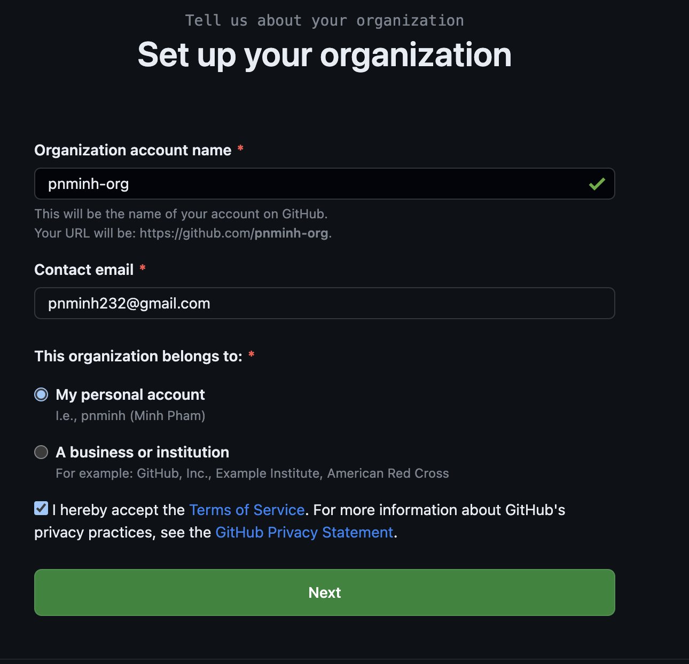 


In addition, to enable Jenkins server communication with our GitHub organization, create a GitHub access token. Visit `Personal account's Settings > Developer settings > Personal access tokens > Fine-grained tokens` to generate a new token. Although classic tokens are available, fine-grained tokens offer more granular access control.

Make sure the `Resource owner` is set to your organization account:
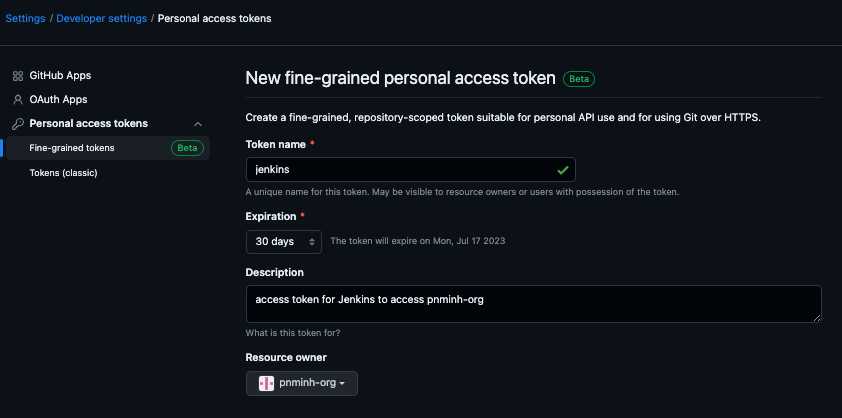  

For our pipeline to function correctly with the installed plugins, `read-only` access is necessary for the following GitHub organization permissions: `Contents`, `Metadata`, and `Pull requests`. If you want Jenkins to modify data, write permissions will be required as well. Remember to save the generated token securely, as GitHub displays it only once.

### Configure Organization Folder item

### Scanning repositories and run the first pipeline

### Everthing as code


### Set up K8s cluster
```
$ minikube start
$ minikube status

minikube
type: Control Plane
host: Running
kubelet: Running
apiserver: Running
kubeconfig: Configured
```
Install Jenkins using helm chart
```
$ helm repo add jenkins https://charts.jenkins.io
$ helm repo update
$ kubectl create namespace jenkins
$ helm install jenkins --namespace jenkins jenkins/jenkins --wait
$ kubectl --namespace jenkins port-forward svc/jenkins 8080:8080
```
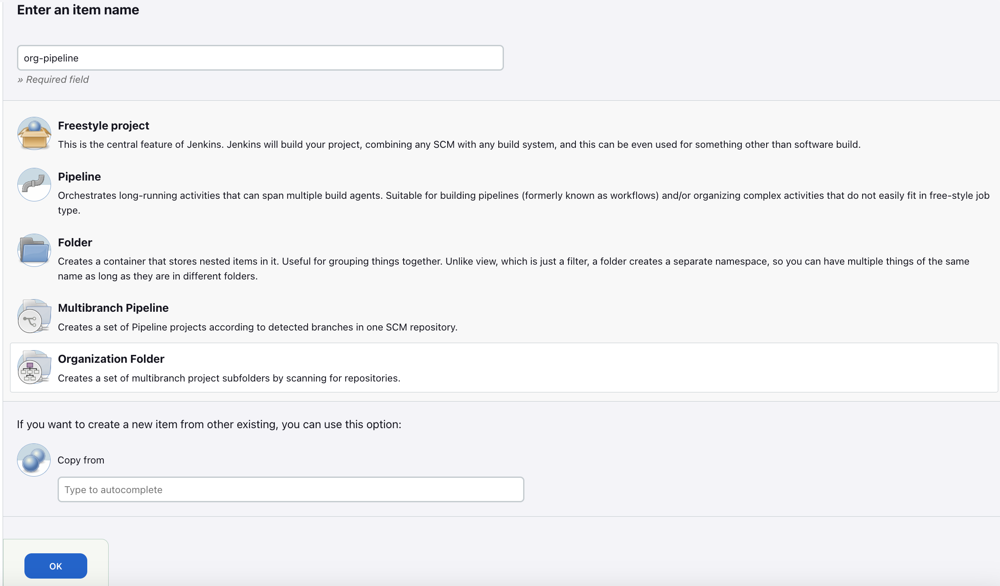  
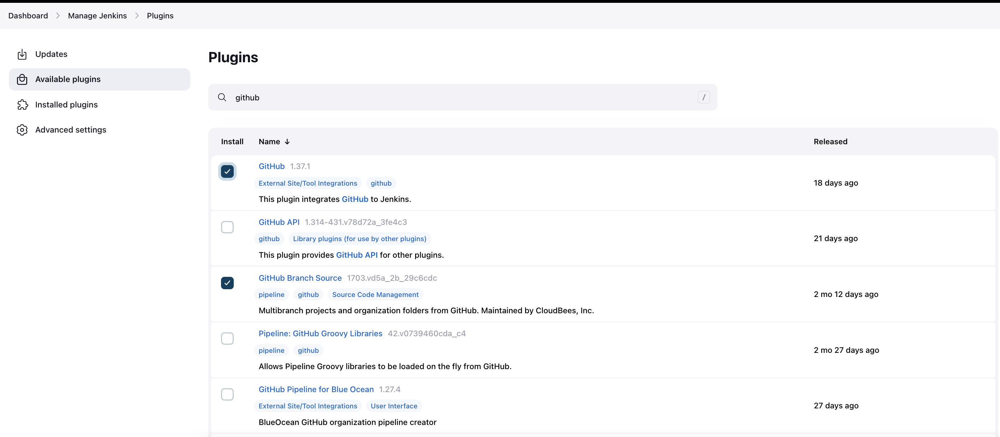  
  
  
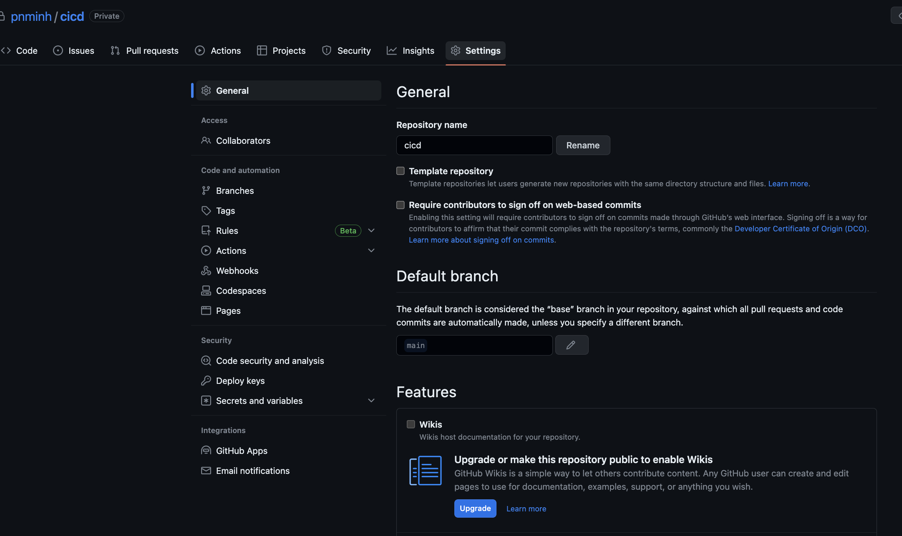  
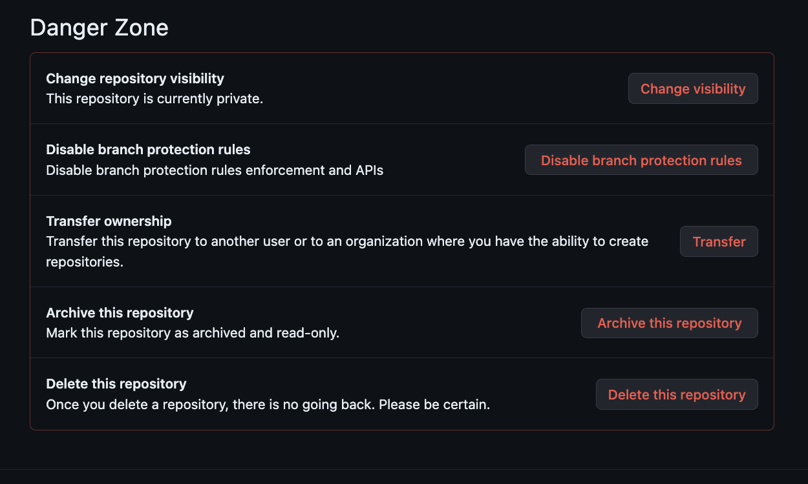  
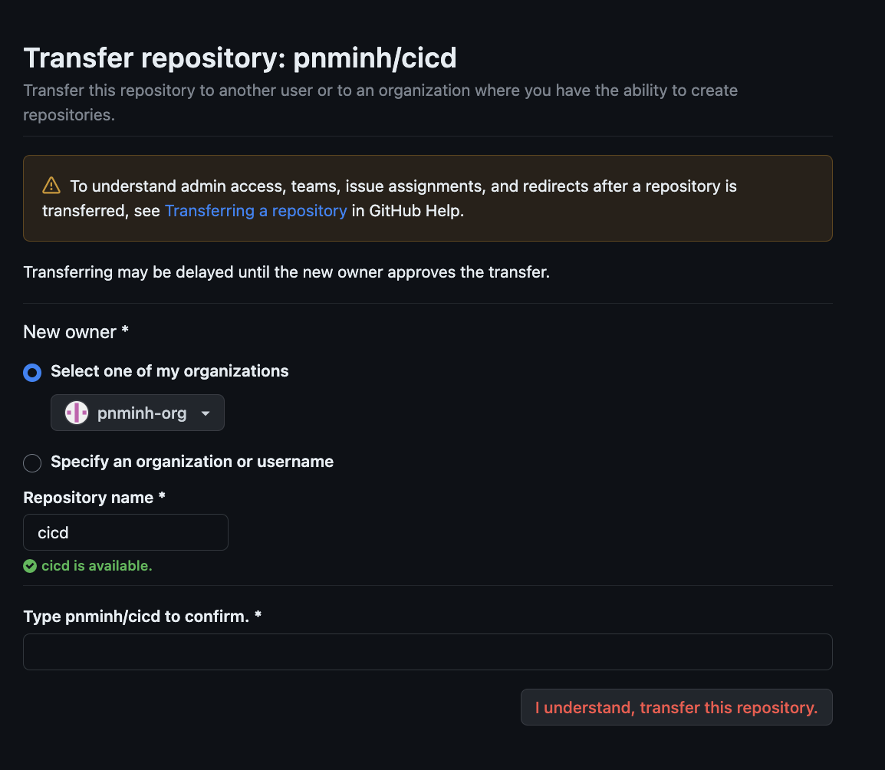  
Install Github plugins for Jenkins
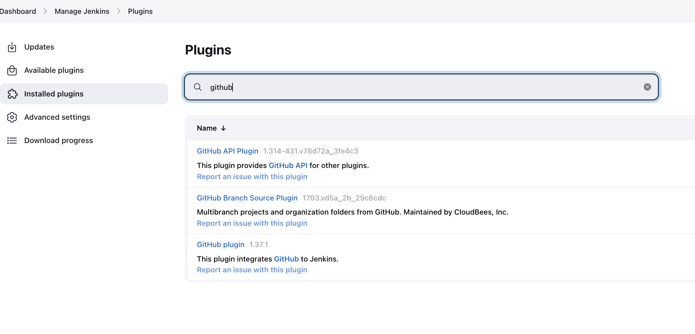  

Get Org API endpoint
- Go to org > Settings > Developer Settings > OAuth Apps
  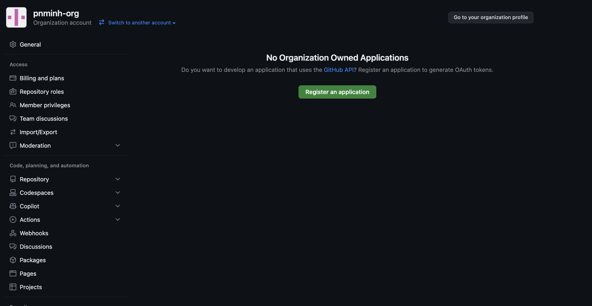  

- Go to Org > Settings > 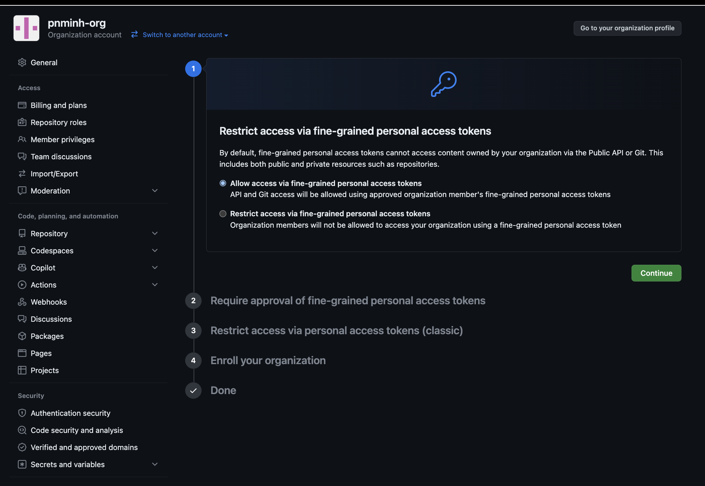  
- Go to User account > Developer settings > Personal access tokens > Fine grained tokens
 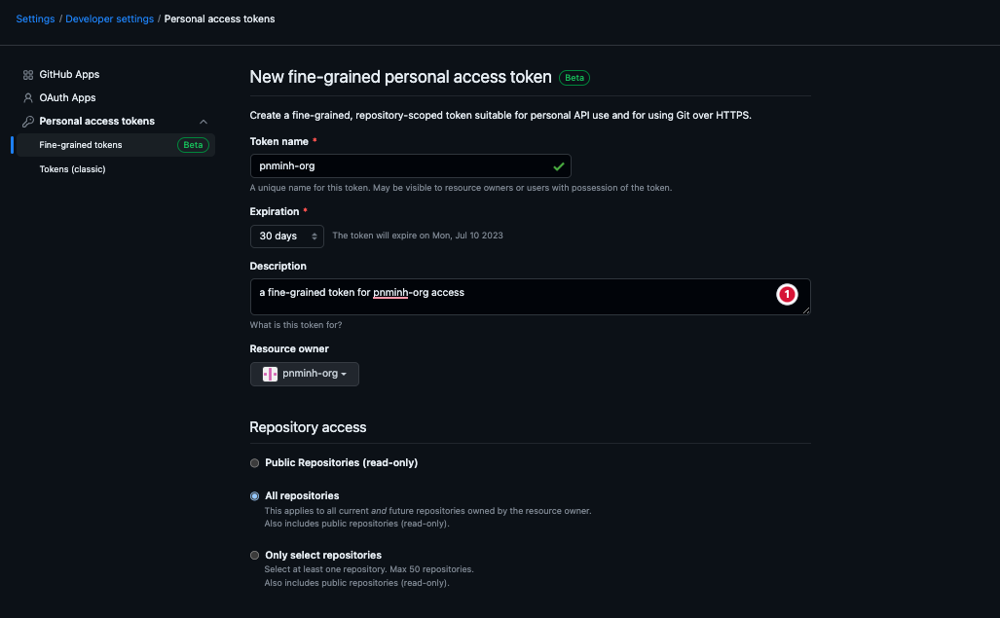  
need `metadata` read access to scan repos
   
need `contents` for branch scanning
  
need `Pull requests` for PR scanning
  

- Can choose classic github token
- Add github enterprise server
  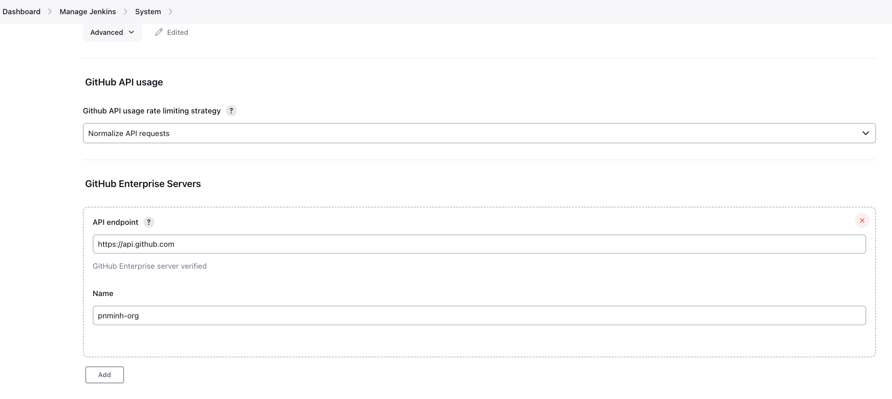  
- Configure org repos(creds are username/password)
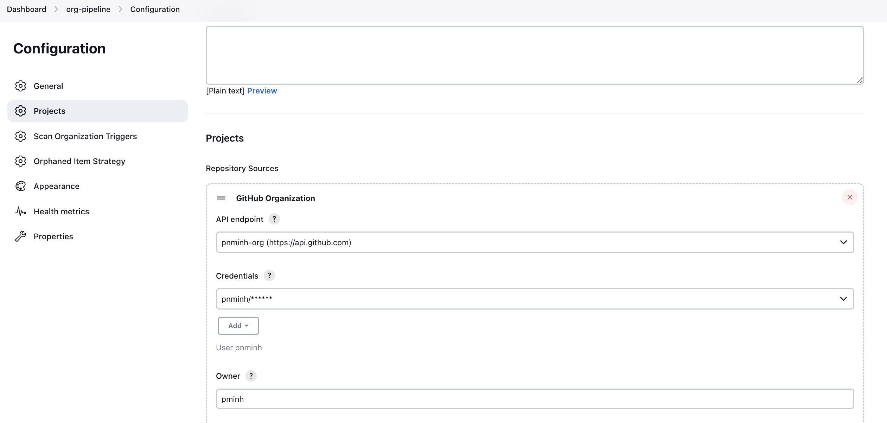  
- Allow Jenkinsfile from other repo to be used(need to restart Jenkins to have it take effect). Also requires [GitHub Branch Source plugin ](https://docs.cloudbees.com/docs/cloudbees-ci/latest/cloud-admin-guide/github-branch-source-plugin)
  
## Configuration as code
```
$ kubectl create namespace jenkins-iac
$ helm upgrade --install jenkins --namespace jenkins-iac jenkins/jenkins --values .helm/jenkins/values.yaml --values .helm/jenkins/creds-values.yaml --wait
```
