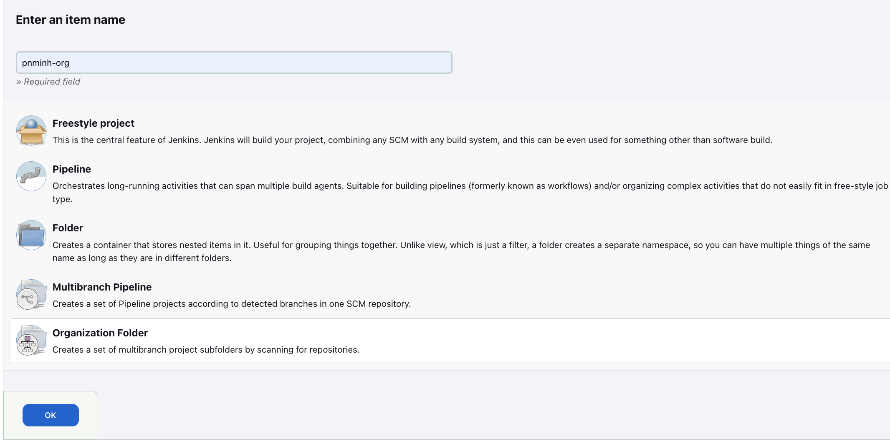

## Organization pipeline using centralized Jenkinsfile
When developing an application and utilizing Jenkins pipeline for CI/CD, it's common to have a Jenkinsfile stored in the same repository as the application. This allows easy configuration of the Jenkinsfile to meet the specific CI/CD requirements of the application.

However, in large organizations, allowing a custom Jenkinsfile in each application repository can have its drawbacks. These include:

* **Code vs. Jenkinsfile**: The application team must balance their focus on writing code for users with maintaining the quality and upkeep of the Jenkinsfile.

* **Cumbersome support**: Supporting organization-wide CI/CD process becomes challenging with teams using unique approaches.

* **Policy compliance**: Enforcing company policies for the CI/CD process, such as security scanning, becomes difficult as application teams are free to implement their own customized workflows.

To tackle these challenges, Jenkins shared libraries can be used, but this approach may still allow application teams to utilize their own Jenkinsfile and introduce undesired customizations.

The [Remote Jenkinsfile Provider](https://plugins.jenkins.io/remote-file/) plugin may offer a solution to those issues. It enables a centralized Jenkinsfile with the `Organization Folder` and `MultiBranch` pipeline options in Jenkins. By adopting this approach, organizations can establish and enforce uniform CI/CD processes and policies across development teams, ensuring consistency and standardization.

This article provides a comprehensive guide on establishing an organization-wide CI/CD pipeline using a centralized Jenkinsfile. We'll cover the step-by-step process, starting with UI setup and transitioning seamlessly to everything-as-code configurations.

## Set up Jenkins server
### Installation options
We will use a local Jenkins server to showcase the process outlined in this article. Among many [installation options](https://www.jenkins.io/doc/book/installing/), containerization emerges as an outstanding choice owing to its remarkable advantages:

* **Isolation and Portability**: Running Jenkins in a container ensures consistent operation across different environments, allowing easy migration and replication on any host system supporting the containerization platform.

* **Easy Deployment and Scalability**: Containerization simplifies deployment with a single container image and enables effortless scaling to handle increased workloads.

* **Version Management and Rollbacks**: Jenkins container images can be versioned and tagged, facilitating easy tracking and rollback to previous versions.

* **Dependency Management**: Containerization provides a self-contained environment, eliminating conflicts with other applications and allowing for efficient management of Jenkins dependencies.

* **Resource Efficiency**: Containers can be configured with specific resource limits, optimizing resource utilization and enabling multiple Jenkins instances on the same host.

* **Easy Updates and Maintenance**: Updating Jenkins becomes straightforward by updating the container image, reducing the risk of disrupting the host environment or other applications.

[Red Hat OpenShift Local](https://developers.redhat.com/products/openshift-local), a lightweight single-node Openshift cluster,  is an excellent choice for deploying our Jenkins containers. OpenShift provides Kubernetes core features with enhanced security, integrated developer experience, and enterprise-focused functionalities. Follow this [link](https://access.redhat.com/documentation/en-us/red_hat_openshift_local/2.5/html/getting_started_guide/installation_gsg) for step-by-step installation instructions tailored to your operating system.

### Installing Jenkins server using Helm chart
To simplify the installation process further, we will leverage the [official helm chart](https://artifacthub.io/packages/helm/jenkinsci/jenkins) developed by Jenkins. This helm chart enables rapid installation with convenient customization options for easy configuration. We use the default configs for the first iteration.
Start with creating a project for Jenkins
```bash
$ oc new-project jenkins
```
By default OCP run pods with non-privileged access to mitigate risks, restrict capabilities, and prevent harmful actions within the cluster. In order to adhere to this security measure, we need to configure a Helm custom values file for Jenkins that enables the usage of a non-root user:

```yaml
controller:
  podSecurityContextOverride: #required for pod running on OCP
    runAsNonRoot: true
    runAsUser: 1000650000
    runAsGroup: 1000650000
  containerSecurityContext: #required for jenkins init container
    runAsUser: 1000650000
    runAsGroup: 1000650000
  initContainerEnv: #https://github.com/jenkinsci/helm-charts/issues/506
    - name: CACHE_DIR
      value: "/tmp/cache"
```

To determine the values for `runAsUser` and `runAsGroup`, you can retrieve them from the `annotations` of the OpenShift project associated with Jenkins. Use the following oc command to fetch the values:
```bash
oc get project/jenkins -o jsonpath='uid-range:{.metadata.annotations.openshift\.io/sa\.scc\.uid-range}{"\n"}supplement-groups:{.metadata.annotations.openshift\.io/sa\.scc\.supplemental-groups}{"\n"}' 
uid-range:1000670000/10000
supplement-groups:1000670000/10000
```
You can read more about Openshift's `uid` and `gid` [here](https://cloud.redhat.com/blog/a-guide-to-openshift-and-uids)

In addition to the security configurations, it is important to note that the plugins specified using `controller.installPlugins` in the [default helm values](https://github.com/jenkinsci/helm-charts/blob/main/charts/jenkins/values.yaml) might not be up-to-date or may have conflicting dependency versions with other plugins. It is strongly recommended to use specific versions in our custom values file to ensure compatibility and stability. Here are the versions that have been tested at the time of writing this article:
```yaml
controller:
  ...
  installPlugins:
    - kubernetes:3900.va_dce992317b_4
    - workflow-aggregator:596.v8c21c963d92d
    - configuration-as-code:1647.ve39ca_b_829b_42
    - git:5.1.0
```
In an upcoming article, we will explore the creation of a custom Jenkins image that includes all the necessary dependencies. This approach will help avoid conflicting plugin versions and improve the startup time of the Jenkins server."

We then can install Jenkins using helm:
```bash
$ helm upgrade --install jenkins jenkins/jenkins --values .helm/jenkins/values.yaml
```
### Installing required plugins
We can access the Jenkins UI at http://localhost:8080 via port-forwarding:
```bash
$ oc --namespace jenkins port-forward svc/jenkins 8080:8080
```
Log in with the admin user and the password generated during the Jenkins installation process.

Then, navigate to `Manage Jenkins > Plugins > Available plugins` and install the following plugins:

  


- [GitHub](https://plugins.jenkins.io/github/): integrates Jenkins with Github projects as we will use Github as our example   
- [GitHub Branch Source](https://plugins.jenkins.io/github-branch-source/): integrate `Organization Folder` and `Multibranch Pipeline`  items with GitHub
- [Remote Jenkinsfile Provider](https://plugins.jenkins.io/remote-file/): allow using a centralized Jenkinsfile from a remote repository
- [GitHub API](https://plugins.jenkins.io/github-api/): dependency for other GitHub related plugins.

Make sure to restart Jenkins after plugin installation for proper functionality.

### Set up GitHub Organization and access token
GitHub organizations facilitate collaborative work, empowering teams to manage repositories, access permissions, and establish hierarchical structures. To create a new organization, navigate to your `Personal account's Settings > Organizations > New organization`:

 


In addition, to facilitate communication between the Jenkins server and our GitHub organization, it is necessary to create a GitHub access token. Visit `Personal account's Settings > Developer settings > Personal access tokens > Fine-grained tokens` to generate a new token. Although classic tokens are available, fine-grained tokens offer more granular access control.

Make sure the `Resource owner` is set to your organization account:
  

For our pipeline to function correctly with the installed plugins, `read-only` access is necessary for the following GitHub organization permissions: `Contents`, `Metadata`, and `Pull requests`. If you want Jenkins to modify data, write permissions will be required as well. Remember to save the generated token securely, as GitHub displays it only once.
 

### Configure Organization Folder item
Go to `Jenkins UI > New item` and create a `Organization Folder` pipeline.
  

This will lead us to the configuration page. The setup for each section is as follow: 
1. `General`: Add name and descriptions for your organization. 

2. `Projects`: Select `GitHub Organization`. Leave `API endpoint` field empty unless you have a custom server for your org. For `Credentials`, add the access token generated from the previous step by clicking `Add` to add your credentials, either at `global` scope or at the pipeline's one.
  
Use the GitHub organization account name for `Owner` field.
The configurations should look like this:
  
For `Behaviors`, you can select how Jenkins check out repositories, branches and PRs for builds. Apart from default behaviors, we will filter the repositories based on their topic names by selecting `Filter by Repository Topics` option. Only those that have all the mentioned `topics` will be added to the organization folder
  


1. `Project Recognizers`: remove `Pipeline Jenkinsfile` option and choose `Remote Jenkinsfile Provider Plugin` instead.
For that, I use the one on [my GitHub organization's cicd repository](https://github.com/pnminh-org/cicd) located at `jenkins/org-pipeline/Jenkinsfile`.


Leave other settings unchanged and save the configuration. 

### Scanning repositories and run the first pipeline
To align with our organization's configuration from the previous step, only repositories with the `cicd` topic are added. Let's create a new repository and assign the `cicd` topic to it.
  

Now go back to `Jenkins UI Dashboard> [Your Org folder name] > Scan Organization Now`. The new repository should show up after the scan.
  
When we run a build, the remote Jenkinsfile will also be checked out and used for the pipeline:
  


### Jenkins configuration as code
Instead of going through the Jenkins UI to set up our `Organization folder` structure, Jenkins provides [Jenkins Configuration as Code plugin](https://www.jenkins.io/projects/jcasc/) to configure Jenkins pipelines in a fully reproducible way. 
Let's first add the additional plugins we need for our pipeline to the `values.yaml` file
```yaml
controller:
  ...
  additionalPlugins:
    - github-api:1.314-431.v78d72a_3fe4c3
    - github:1.37.1
    - github-branch-source:1725.vd391eef681a_e #for Github repo structure 
    - remote-file:1.23 #for remote Jenkinsfile
    - job-dsl:1.84 #for org folder setup
```

Then add the GitHub access token to Jenkins. create a file, `creds-values.yaml`
```yaml
controller:
  JCasC:
    configScripts:
      global-creds: |
        credentials:
          system:
            domainCredentials:
              - credentials:
                  - usernamePassword:
                      scope: GLOBAL
                      id: "pnminh-org"
                      username: "pnminh"
                      password: <GITHUB_ACCESS_TOKEN>
                      description: "Username/Password Credentials for pnminh-org authentication"
```
We then can create a [Job DSL](https://plugins.jenkins.io/job-dsl). If you are not familiar with Job DSL syntax, [here](https://plugins.jenkins.io/job-dsl/#plugin-content-getting-started) is a quick way to test your the script before make it into a working version. Also the `Job DSL API reference` located at https://<your.jenkins.installation>/plugin/job-dsl/api-viewer/index.html should give you the idea of what need to be added to the script.  Here is the one, `org-folder-job-dsl-values.yaml`, that will configure our `Organization folder` in the same way we did with the UI:
```yaml
controller:
  JCasC:
    configScripts:
      job-dsl: | #file name, can be any name. The content will be picked up by Jenkins
        jobs:
          - script: |
              organizationFolder('pnminh-org') {
                description('This contains branch source jobs for Bitbucket and GitHub')
                displayName('pnminh-org')
                triggers {
                  cron('@midnight')
                }
                organizations {
                  github {
                    repoOwner("pnminh-org")
                    credentialsId("pnminh-org")
                    traits {
                      // Discovers branches on the repository.
                      gitHubBranchDiscovery {
                        // Determines which branches are discovered.
                        // 1 = Exclude branches that are also filed as PRs
                        strategyId(1)
                      }
                      gitHubPullRequestDiscovery {
                        // 1 = Merging the pull request with the current target branch revision
                        strategyId(1)
                      }
                      // Only scan repos that have topics
                      gitHubTopicsFilter {
                        topicList("cicd")
                      }
                      gitHubExcludeArchivedRepositories()
                    }
                  }
                }
                configure {
                  def traits = it / navigators / 'org.jenkinsci.plugins.github__branch__source.GitHubSCMNavigator' / 'traits'
                  traits << 'org.jenkinsci.plugins.github__branch__source.ForkPullRequestDiscoveryTrait' {
                      strategyId(1)
                      trust(class: 'org.jenkinsci.plugins.github_branch_source.ForkPullRequestDiscoveryTrait$TrustEveryone')
                  }                 
                }
                projectFactories {
                  remoteJenkinsFileWorkflowMultiBranchProjectFactory {
                    // File or directory name used as marker to recognize the project need to be build.
                    localMarker(null)
                    remoteJenkinsFileSCM {
                      // The git plugin provides fundamental git operations for Jenkins projects.
                      gitSCM {
                        userRemoteConfigs {
                          userRemoteConfig {
                            // Specify the URL or path of the git repository.
                            url("https://github.com/pnminh-org/cicd")
                            // ID of the repository, such as origin, to uniquely identify this repository among other remote repositories.
                            name("origin")
                            // A refspec controls the remote refs to be retrieved and how they map to local refs.
                            refspec("main")
                            // Credential used to check out sources.
                            credentialsId("pnminh-org")
                          }
                        }
                        // List of branches to build.
                        branches {
                          branchSpec {
                          // Specify the branches if you'd like to track a specific branch in a repository.
                            name("main")
                          }
                        }
                        browser {
                          github {
                            // Specify the HTTP URL for this repository's GitHub page (such as https://github.com/jquery/jquery).
                            repoUrl("https://github.com/pnminh-org/cicd")
                          }
                        }
                        gitTool(null)
                      }
                    }
                    matchBranches(false)
                    remoteJenkinsFile("jenkins/org-pipeline/Jenkinsfile")
                  }
                }       
              }
```
**Note**: as the time of writing, I could not use the Job DSL API script for `ForkPullRequestDiscoveryTrait` as part of `GitHub Branch Source` plugin. Using [configure block](https://github.com/jenkinsci/job-dsl-plugin/wiki/The-Configure-Block), and the path retrieved from `$JENKINS_HOME/jobs/<Organization folder name>/config.xml` did the trick for me. More info of the issue can be found here `https://issues.jenkins.io/browse/JENKINS-61119`
Run a new installation of Jenkins using all the values files we just created/updated:
```bash
$ oc new-project jenkins-jcasc
$ helm upgrade --install jenkins jenkins/jenkins --values .helm/jenkins/values.yaml --values .helm/jenkins/creds-values.yaml --values .helm/jenkins/org-folder-job-dsl-values.yaml
```
